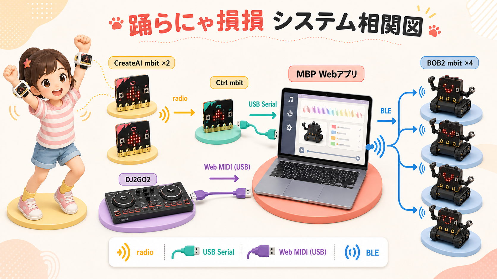
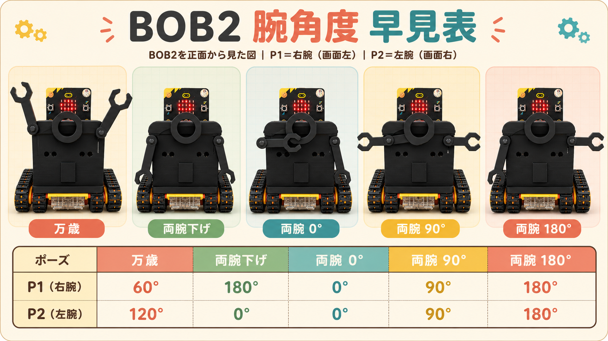

# BOB2 AI Dancing 仕様書

## 1. 位置づけ

本書はMaker Faire Tokyo 2026時点の実装仕様を記録する。作品は未完成であり、既知の不具合・改善案は[Issueリスト](Issueリスト.md)で管理する。記述とコードが食い違う場合、このスナップショットではコードを正とする。

## 2. 作品概要

4台のBOB2が順番に模範ダンスを披露し、参加者がその動きをまねる。参加者の左右の腕に装着したCreateAI micro:bitが動作の一致度を推定し、MacBook Pro上のWebアプリが採点と進行を行う。DJ2GO2またはWeb画面からゲームを操作する。

## 3. システム構成

| 構成要素 | 台数 | 役割 | 接続 |
|---|---:|---|---|
| CreateAI micro:bit | 2 | 左腕・右腕の4動作とidleを認識 | micro:bit radio、group 96 |
| Control micro:bit | 1 | CreateAI値を受信してMacへ中継 | radio → USB Serial 115200 bps |
| MacBook Pro | 1 | Webアプリ、ゲーム進行、採点、BLE制御 | USB Serial、Web MIDI、BLE |
| DJ2GO2 | 1 | 初級・上級の開始と中断 | USB / Web MIDI |
| BOB2 micro:bit | 4 | 模範演技、LED表示、最終演出 | BLE Nordic UART |

### ファームウェア

| 対象 | 書き込みファイル | ソース |
|---|---|---|
| BOB2 4台共通 | `BOB2-microbit/BOB2mbit-common.hex` | `BOB2-microbit/main.ts` |
| Control | `Control-microbit/CtrlMbit.hex` | `Control-microbit/main.ts` |
| CreateAI 左腕 | `CreateAI-microbit/CreateAI-L.hex` | `CreateAI-microbit/CreateAI-L.ts` |
| CreateAI 右腕 | `CreateAI-microbit/CreateAI-R.hex` | `CreateAI-microbit/CreateAI-R.ts` |

CreateAIのHEXには学習モデルが含まれる。TSはMakeCodeで編集した処理を記録するために併載する。

## 4. ゲーム進行

1. BOB2を4台接続し、ID 0〜3を確認する。
2. DJ2GO2または画面から初級・上級を選択して開始する。
3. Webアプリが接続済みBOB2の演技順をランダムに決める。
4. 対象BOB2がチェックを1秒、`3`・`2`・`1`を各0.5秒、`GO`を表示して演技する。
5. 演技指示から4.4秒後に、そのBOB2に対応するCreateAI値を250ms間隔で20回取得する。
6. Webアプリは採点を並行させながら、設定済みの演技時間後に次のBOB2へ進む。
7. 全台の演技と採点完了後、0〜4点の最終結果をBOB2へ送る。
8. BOB2は輪が広がる表示の後、IDの小さい機体から得点数分だけ二重丸を表示する。
9. 全台が3秒間バイバイし、接続済み待機表示へ戻る。

中断操作は全BOB2の車輪と演技を停止し、LEDを消灯する。デモモードでは実機接続なしで4台分の進行を模擬する。

## 5. ダンスと難易度

| BOB ID | CreateAIラベル | ダンス |
|---:|---|---|
| 0 | `danceNo0` | バイバイ |
| 1 | `danceNo1` | 左右フリフリ |
| 2 | `danceNo2` | 変なおじさん |
| 3 | `danceNo3` | 上でバーン |

初級は基準速度、上級は主な待ち時間を約60%に短縮する。Webアプリ側の演技完了待ちは、BOB IDごとに実測値を設定している。

## 6. CreateAIと採点

左右それぞれのCreateAI micro:bitは、4動作と`idle`の確信度を50ms間隔で順に送る。

| 側 | radio key | ControlからMacへの形式 |
|---|---|---|
| 右 | `d0-R`〜`d3-R`、`idle-R` | `danceNo0-R:83`、`idle-R:12`など |
| 左 | `d0-L`〜`d3-L`、`idle-L` | `danceNo0-L:69`、`idle-L:8`など |

現行Webアプリは、左右を区別して受信診断へ表示する一方、採点では各`danceNo`について最後に受信した値を250ms間隔で20回記録する。通信直後の不安定値を避けるため1回目を除外し、残る19件を平均する。

| 平均確信度 | 内部得点 | 表示 |
|---:|---:|---|
| 85%以上 | 100 | ◎ |
| 65%以上85%未満 | 80 | ○ |
| 40%以上65%未満 | 50 | △ |
| 40%未満 | 0 | × |

接続台数が4台未満の場合は、合計点を4台相当に正規化して最終評価を算出する。最終LED点数は正規化後の合計を100で割って四捨五入し、0〜4へ制限する。

左右それぞれ20件、合計40件を独立に平均する案は旧文書に記載されていたが、このスナップショットには未実装である。

## 7. BOB2仕様

### ID

- 4台へ同じファームウェアを書き込み、A+BでID 0〜3を設定する。
- 未設定値は99で、LEDには専用の「9」形状を表示する。
- IDは不揮発領域へ保存し、BLE接続時と変更時に`ID,n`を通知する。
- ゲーム中は本体ボタンとID変更を受け付けない。

### 腕と車輪

- P1は右腕、P2は左腕。左右はBOB2自身から見た向きで表す。
- 万歳はP1=60度、P2=120度。
- 腕下げはP1=180度、P2=0度。
- 車輪はP13〜P16を使用する。

### 本体ボタン

| 操作 | 動作 |
|---|---|
| A | 両腕を万歳位置にして保持 |
| B | IDを2秒表示 |
| A+B | IDを `0 → 1 → 2 → 3 → 0` と変更 |
| ロゴ | 両腕を下げ、右0.2秒→左0.4秒→右0.2秒と旋回 |

### LED状態

- BLE未接続: ×
- 接続済み待機: 4種類の模様を1秒間隔でランダム表示
- 演技選択: チェック
- 演技開始: `3 → 2 → 1 → GO`
- 演技中: Happyまたは演技用の左右顔
- 演技終了: 消灯
- 最終結果: 輪アニメーションと二重丸

## 8. BOB2 BLEコマンド

MacからBOB2へ、改行区切りの数値CSVを送る。

| コマンド | 意味 |
|---|---|
| `0,パターン,レベル` | 模範演技。現行パターンは0、レベルは0=初級・1=上級 |
| `1,対象ID` | 対象機のIDを5秒表示 |
| `2,評価コード,得点` | 旧個別得点表示。現行ゲーム進行では未使用 |
| `3,最終点数` | 0〜4点の最終表示 |
| `4` | 中断、車輪停止、LED消灯 |
| `5` | 初期位置、両腕30度、待機表示 |
| `6,テスト番号` | 0=A、1=B、2=ロゴ相当の動作確認 |
| `7` | 3秒間バイバイして待機へ復帰 |

BOB2からMacへは`ID,n`を返す。`ID?`を受信すると現在のIDを再送する。

## 9. Webアプリ

- ローカルHTTPサーバー: `127.0.0.1:4173`
- 対応ブラウザ: Web SerialとWeb MIDIを利用できるChromeまたはEdge
- BLE: Pythonの`bleak`をNode.jsから起動し、BOB2を最大4台管理
- 画面機能: 難易度選択、開始・中断・初期位置、BLE接続管理、個別動作確認、CreateAI受信診断、採点履歴、デモモード

## 10. 記録と既知課題

- [運用マニュアル](MANUAL.md)
- [System Final Test](SFT.md)
- [Issueリスト](Issueリスト.md)
- [作業録](作業録.md)
